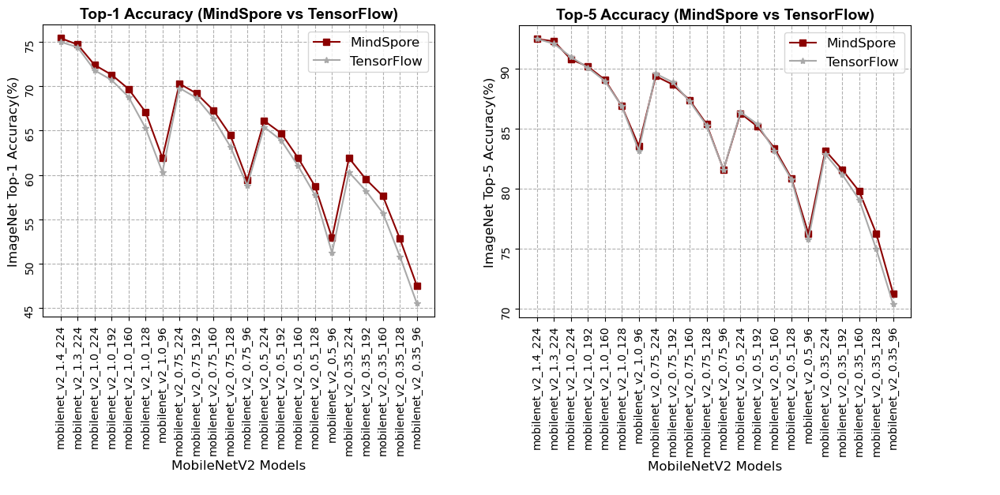

# MobileNetV2

***

The MobileNetV2 architecture is based on an inverted residual structure where the input and output of the residual block are thin bottleneck layers opposite to traditional residual models which use expanded representations in the input an MobileNetV2 uses lightweight depthwise convolutions to filter features in the intermediate expansion layer.

The architectural definition of each network refers to the following papers:

[1] Mark Sandler, Andrew Howard, Menglong Zhu, Andrey Zhmoginov, Liang-Chieh Chen. [MobileNetV2: Inverted Residuals and Linear Bottlenecks](https://arxiv.org/pdf/1801.04381.pdf). arXiv preprint arXiv: 1801.04381.

<div align=center></div>

## Performance

***

### Precision comparison line chart

The following line chart shows the accuracy comparison of MobileNetV2 network in Top1 and Top5 of MindSpore and TensorFlow.

<div align=center></div>

## pretrained models

***

The following table lists all MobilenetV2 imagenet checkpoints. Each model verifies the accuracy
of Top-1 and Top-5, and compares it with that of TensorFlow.

|  | MindSpore | MindSpore | TensorFlow | TensorFlow |||
|:-----:|:---------:|:--------:|:---------:|:---------:|:---------:|:---------:|
| Model | Top-1 (%) | Top-5 (%) | Top-1 (%) | Top-5 (%) | Download | Config |
| mobilenet_v2_1.4_224 | 75.43 | 92.5 | 75.0 | 92.5 | [model](https://download.mindspore.cn/vision/classification/mobilenet_v2_1.4_224.ckpt) | [config](../../../mindvision/classification/config/mobilenet_v2/mobilenet_v2_1.4_224_imagenet2012.yaml) |
| mobilenet_v2_1.3_224 | 74.7 | 92.3 | 74.4 | 92.1 | [model](https://download.mindspore.cn/vision/classification/mobilenet_v2_1.3_224.ckpt) | [config](../../../mindvision/classification/config/mobilenet_v2/mobilenet_v2_1.3_224_imagenet2012.yaml) |
| mobilenet_v2_1.0_224 | 72.4 | 90.8 | 71.8 | 91.0 | [model](https://download.mindspore.cn/vision/classification/mobilenet_v2_1.0_224.ckpt) | [config](../../../mindvision/classification/config/mobilenet_v2/mobilenet_v2_1.0_224_imagenet2012.yaml) |
| mobilenet_v2_1.0_192 | 71.3 | 90.2 | 70.7 | 90.1 | [model](https://download.mindspore.cn/vision/classification/mobilenet_v2_1.0_192.ckpt) | [config](../../../mindvision/classification/config/mobilenet_v2/mobilenet_v2_1.0_192_imagenet2012.yaml) |
| mobilenet_v2_1.0_160 | 69.7 | 89.1 | 68.8 | 89.0 | [model](https://download.mindspore.cn/vision/classification/mobilenet_v2_1.0_160.ckpt) | [config](../../../mindvision/classification/config/mobilenet_v2/mobilenet_v2_1.0_160_imagenet2012.yaml) |
| mobilenet_v2_1.0_128 | 67.1 | 86.9 | 65.3 | 86.9 | [model](https://download.mindspore.cn/vision/classification/mobilenet_v2_1.0_128.ckpt) | [config](../../../mindvision/classification/config/mobilenet_v2/mobilenet_v2_1.0_128_imagenet2012.yaml) |
| mobilenet_v2_1.0_96 | 61.9 | 83.6 | 60.3 | 83.2 | [model](https://download.mindspore.cn/vision/classification/mobilenet_v2_1.0_96.ckpt) | [config](../../../mindvision/classification/config/mobilenet_v2/mobilenet_v2_1.0_96_imagenet2012.yaml) |
| mobilenet_v2_0.75_224 | 70.3 | 89.4 | 69.8 | 89.6 | [model](https://download.mindspore.cn/vision/classification/mobilenet_v2_0.75_224.ckpt) | [config](../../../mindvision/classification/config/mobilenet_v2/mobilenet_v2_0.75_224_imagenet2012.yaml) |
| mobilenet_v2_0.75_192 | 69.2 | 88.7 | 68.7 | 88.9 | [model](https://download.mindspore.cn/vision/classification/mobilenet_v2_0.75_192.ckpt) | [config](../../../mindvision/classification/config/mobilenet_v2/mobilenet_v2_0.75_192_imagenet2012.yaml) |
| mobilenet_v2_0.75_160 | 67.3 | 87.4 | 66.4 | 87.3 | [model](https://download.mindspore.cn/vision/classification/mobilenet_v2_0.75_160.ckpt) | [config](../../../mindvision/classification/config/mobilenet_v2/mobilenet_v2_0.75_160_imagenet2012.yaml) |
| mobilenet_v2_0.75_128 | 64.5 | 85.4 | 63.2 | 85.3 | [model](https://download.mindspore.cn/vision/classification/mobilenet_v2_0.75_128.ckpt) | [config](../../../mindvision/classification/config/mobilenet_v2/mobilenet_v2_0.75_128_imagenet2012.yaml) |
| mobilenet_v2_0.75_96 | 59.4 | 81.6 | 58.8 | 81.6 | [model](https://download.mindspore.cn/vision/classification/mobilenet_v2_0.75_96.ckpt) | [config](../../../mindvision/classification/config/mobilenet_v2/mobilenet_v2_0.75_96_imagenet2012.yaml) |
| mobilenet_v2_0.5_224 | 66.1 | 86.3 | 65.4 | 86.4 | [model](https://download.mindspore.cn/vision/classification/mobilenet_v2_0.5_224.ckpt) | [config](../../../mindvision/classification/config/mobilenet_v2/mobilenet_v2_0.5_224_imagenet2012.yaml) |
| mobilenet_v2_0.5_192 | 64.7 | 85.2 | 63.9 | 85.4 | [model](https://download.mindspore.cn/vision/classification/mobilenet_v2_0.5_192.ckpt) | [config](../../../mindvision/classification/config/mobilenet_v2/mobilenet_v2_0.5_192_imagenet2012.yaml) |
| mobilenet_v2_0.5_160 | 61.9 | 83.4 | 61.0 | 83.2 | [model](https://download.mindspore.cn/vision/classification/mobilenet_v2_0.5_160.ckpt) | [config](../../../mindvision/classification/config/mobilenet_v2/mobilenet_v2_0.5_160_imagenet2012.yaml) |
| mobilenet_v2_0.5_128 | 58.7 | 80.9 | 57.7 | 80.8 | [model](https://download.mindspore.cn/vision/classification/mobilenet_v2_0.5_128.ckpt) | [config](../../../mindvision/classification/config/mobilenet_v2/mobilenet_v2_0.5_128_imagenet2012.yaml) |
| mobilenet_v2_0.5_96 | 52.9 | 76.3 | 51.2 | 75.8 | [model](https://download.mindspore.cn/vision/classification/mobilenet_v2_0.5_96.ckpt) | [config](../../../mindvision/classification/config/mobilenet_v2/mobilenet_v2_0.5_96_imagenet2012.yaml) |
| mobilenet_v2_0.35_224 | 61.9 | 83.2 | 60.3 | 82.9 | [model](https://download.mindspore.cn/vision/classification/mobilenet_v2_0.35_224.ckpt) | [config](../../../mindvision/classification/config/mobilenet_v2/mobilenet_v2_0.35_224_imagenet2012.yaml) |
| mobilenet_v2_0.35_192 | 59.5 | 81.6 | 58.2 | 81.2 | [model](https://download.mindspore.cn/vision/classification/mobilenet_v2_0.35_192.ckpt) | [config](../../../mindvision/classification/config/mobilenet_v2/mobilenet_v2_0.35_192_imagenet2012.yaml) |
| mobilenet_v2_0.35_160 | 57.6 | 79.8 | 55.7 | 79.1 | [model](https://download.mindspore.cn/vision/classification/mobilenet_v2_0.35_160.ckpt) | [config](../../../mindvision/classification/config/mobilenet_v2/mobilenet_v2_0.35_160_imagenet2012.yaml) |
| mobilenet_v2_0.35_128 | 52.8 | 76.3 | 50.8 | 75.0 | [model](https://download.mindspore.cn/vision/classification/mobilenet_v2_0.35_128.ckpt) | [config](../../../mindvision/classification/config/mobilenet_v2/mobilenet_v2_0.35_128_imagenet2012.yaml) |
| mobilenet_v2_0.35_96 | 47.5 | 71.3 | 45.5 | 70.4 | [model](https://download.mindspore.cn/vision/classification/mobilenet_v2_0.35_96.ckpt) | [config](../../../mindvision/classification/config/mobilenet_v2/mobilenet_v2_0.35_96_imagenet2012.yaml) |

## Training

***

### Parameter description

| Parameter | Default | Description |
|:-----|:---------|:--------|
| device_target | GPU | Hardware device |
| data_url |  | Path to training dataset |
| pretrained | False | Path to pretrained model |
| run_distribute | True | Distributed parallel training |
| num_parallel_workers | 8 | Number of parallel workers |
| dataset_sink_mode | True | Data sinking mode |
| num_classes | 1001 | Number of dataset classifications |
| batch_size | 64 | Number of batch size |
| repeat_num | 1 | Number of data repetitions |
| momentum | 0.9 | Momentum parameter |
| epoch_size | 200 | Number of epoch |
| keep_checkpoint_max | 10 | Maximum number of checkpoints saved |
| ckpt_save_dir | './mobilenet_v2' | Save path of checkpoint |
| lr_decay_mode | cosine_decay_lr | Learning rate decay mode |
| decay_epoch | 200 | Number of decay epoch |
| smooth_factor | 0.1 | Label smoothing factor |
| max_lr | 0.1 | maximum learning rate |
| min_lr | 0.0 | minimum learning rate |
| milestone |  | A list of milestone |
| learning_rates |  | A list of learning rates |
| alpha | 1.0 | Magnification factor |
| resize | 224 | Resize the height and weight of picture |

## Examples

***

### Train

- The following configuration uses 8 GPUs for training. The magnification factor is set to 1.0 and the image input size is set to 224.

  ```shell
  mpirun -n 8 python mobilenet_v2_imagenet_train.py --alpha 1.0 --resize 224 --data_url ./dataset/imagenet
  ```

  output:

  ```text
  Epoch:[0/200], step:[2502/2502], loss:[4.676/4.676], time:872084.093, lr:0.10000
  Epoch time:883614.453, per step time:353.163, avg loss:4.676
  Epoch:[1/200], step:[2502/2502], loss:[4.452/4.452], time:693370.244, lr:0.09998
  Epoch time:693374.709, per step time:277.128, avg loss:4.452
  Epoch:[2/200], step:[2502/2502], loss:[3.885/3.885], time:685880.388, lr:0.09990
  Epoch time:685884.401, per step time:274.134, avg loss:3.885
  Epoch:[3/200], step:[2502/2502], loss:[3.550/3.550], time:689409.851, lr:0.09978
  Epoch time:689413.237, per step time:275.545, avg loss:3.550
  Epoch:[4/200], step:[2502/2502], loss:[3.371/3.371], time:692162.583, lr:0.09961
  Epoch time:692166.163, per step time:276.645, avg loss:3.371

  ...
  ```

- The following configuration uses yaml file for training.

  ```shell
  mpirun -n 8 python examples/classification/tools/train_config.py -c mindvision/classification/config/mobilenet_v2/mobilenet_v2_1.0_224_imagenet2012.yaml
  ```  

  output:

  ```text
  Epoch:[0/200], step:[2502/2502], loss:[5.350/5.350], time:860471.865, lr:0.10000
  Epoch time:867121.671, per step time:346.571, avg loss:5.350
  Epoch:[1/200], step:[2502/2502], loss:[4.737/4.737], time:838193.601, lr:0.09998
  Epoch time:838236.939, per step time:335.027, avg loss:4.737
  Epoch:[2/200], step:[2502/2502], loss:[4.430/4.430], time:841103.726, lr:0.09990
  Epoch time:841167.664, per step time:336.198, avg loss:4.430
  Epoch:[3/200], step:[2502/2502], loss:[3.845/3.845], time:844526.365, lr:0.09978
  Epoch time:844609.499, per step time:337.574, avg loss:3.845
  Epoch:[4/200], step:[2502/2502], loss:[3.604/3.604], time:840851.149, lr:0.09961
  Epoch time:840912.141, per step time:336.096, avg loss:3.604

  ...
  ```

### Eval

- The following configuration for eval. The magnification factor is set to 0.75 and the image input size is set to 192.

  ```shell
  python mobilenet_v2_imagenet_eval.py --alpha 0.75 --resize 192 --pretrained True --data_url ./dataset/imagenet
  ```

  output:

  ```text
  {'Top_1_Accuracy': 0.6922876602564103, 'Top_5_Accuracy': 0.8871594551282052}
  ```

- The following configuration uses yaml file for eval.

  ```shell
  python examples/classification/tools/eval_config.py -c mindvision/classification/config/mobilenet_v2/mobilenet_v2_0.75_192_imagenet2012.yaml
  ```

  output:

  ```text
  {'Top_1_Accuracy': 0.692441581306018, 'Top_5_Accuracy': 0.8872439180537772}
  ```

### Infer

- The following configuration for infer. The magnification factor is set to 1.0 and the image input size is set to 224.

  ```shell
  python mobilenet_v2_imagenet_infer.py --alpha 1.0 --resize 224 --pretrained True --data_url ./infer
  ```

  output:

  ```text
  {283: 'Persian cat'}
  ```

<div align=center></div>
