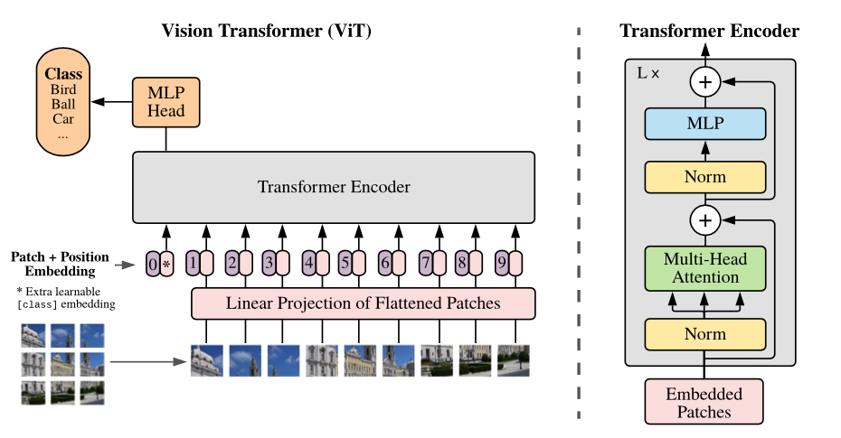

# Vision Transformer

***

by Alexey Dosovitskiy\*†, Lucas Beyer\*, Alexander Kolesnikov\*, Dirk
Weissenborn\*, Xiaohua Zhai\*, Thomas Unterthiner, Mostafa Dehghani, Matthias
Minderer, Georg Heigold, Sylvain Gelly, Jakob Uszkoreit and Neil Houlsby\*†.

(\*) equal technical contribution, (†) equal advising.



Overview of the model: The paper split an image into fixed-size patches, linearly embed each of them, add position embeddings, and feed the resulting sequence of vectors to a standard Transformer encoder. In order to perform classification, authors use the standard approach of adding an extra learnable "classification token" to the sequence.

The architectural definition of each network refers to the following papers:

[1] Dosovitskiy, Alexey, et al. "An image is worth 16x16 words: Transformers for image recognition at scale." arXiv preprint arXiv:2010.11929 (2020).

## pretrained models

***

The following table lists all MobilenetV2 imagenet checkpoints. Each model verifies the accuracy
of Top-1 and Top-5, and compares it with that of TensorFlow.

|  | MindSpore | MindSpore || |
|:-----:|:---------:|:--------:|:---------:|:---------:|
| Model | Top-1 (%) | Top-5 (%) |  Download | Config |
| vit_b_16_224 | 75.244 | 92.934 | [model](https://download.mindspore.cn/vision/classification/vit_b_16_224.ckpt) | [config](../../../mindvision/classification/config/vit/vit_b_16_224.yaml) |
| vit_b_16_384 | 78.977 | 94.928 | [model](https://download.mindspore.cn/vision/classification/vit_b_16_384.ckpt) | [config](../../../mindvision/classification/config/vit/vit_b_16_384.yaml) |
| vit_l_16_224 | 78.83 | 94.626 | [model](https://download.mindspore.cn/vision/classification/vit_l_16_224.ckpt) | [config](../../../mindvision/classification/config/vit/vit_l_16_224.yaml) |
| vit_l_16_384 | 81.526 | 96.025 | [model](https://download.mindspore.cn/vision/classification/vit_l_16_384.ckpt) | [config](../../../mindvision/classification/config/vit/vit_l_16_384.yaml) |
| vit_b_32_224 | 75.748 | 92.518 | [model](https://download.mindspore.cn/vision/classification/vit_b_32_224_tv.ckpt) | [config](../../../mindvision/classification/config/vit/vit_b_32_224.yaml) |
| vit_b_32_384 | 75.426 | 92.943 | [model](https://download.mindspore.cn/vision/classification/vit_b_32_384.ckpt) | [config](../../../mindvision/classification/config/vit/vit_b_32_384.yaml) |
| vit_l_32_224 | 76.95 | 93.1 | [model](https://download.mindspore.cn/vision/classification/vit_l_32_224_tv.ckpt) | [config](../../../mindvision/classification/config/vit/vit_l_32_224.yaml) |

## Training

### Parameter description

| Parameter | Default | Description |
|:-----|:---------|:--------|
| device_target | GPU | Hardware device |
| data_url |  | Path to training dataset |
| pretrained | False | Path to pretrained model |
| run_distribute | True | Distributed parallel training |
| num_parallel_workers | 8 | Number of parallel workers |
| dataset_sink_mode | True | Data sinking mode |
| num_classes | 1000 | Number of dataset classifications |
| batch_size | 64 | Number of batch size |
| repeat_num | 1 | Number of data repetitions |
| momentum | 0.9 | Momentum parameter |
| epoch_size | 100 | Number of epoch |
| keep_checkpoint_max | 10 | Maximum number of checkpoints saved |
| ckpt_save_dir | './ViT' | Save path of checkpoint |
| lr_decay_mode | cosine_decay_lr | Learning rate decay mode |
| decay_epoch | 100 | Number of decay epoch |
| smooth_factor | 0.1 | Label smoothing factor |
| max_lr | 0.1 | maximum learning rate |
| min_lr | 0.0 | minimum learning rate |
| milestone |  | A list of milestone |
| learning_rates |  | A list of learning rates |
| alpha | 1.0 | Magnification factor |
| resize | 224 | Resize the height and weight of picture |

## Examples

### Train

- The following configuration uses 8 GPUs for training.

  ```shell
  mpirun -n 8 python vit_imagenet_train.py --model vit_b_16 --data_url ./dataset/imagenet --lr_decay_mode cosine_decay_lr --resize 224
  ```

- The following configuration uses yaml file for training.

  ```shell
  mpirun -n 8 python examples/classification/tools/train_config.py -c mindvision/classification/config/vit/vit_b_16_224.yaml
  ```  

### Eval

- The following configuration for eval.

  ```shell
  python vit_imagenet_eval.py --model vit_b_16 --data_url ./dataset/imagenet --pretrained True --resize 224
  ```

## References

In this repository release models from the papers

- [1] Dosovitskiy, Alexey, et al. "[An Image is Worth 16x16 Words: Transformers for Image Recognition at Scale.](https://arxiv.org/abs/2010.11929)" arXiv preprint arXiv:2010.11929 (2020).
- [2] Steiner, Andreas, et al. "[How to train your ViT? Data, Augmentation, and Regularization in Vision Transformers](https://arxiv.org/abs/2106.10270)." arXiv preprint arXiv:2106.10270 (2021).
