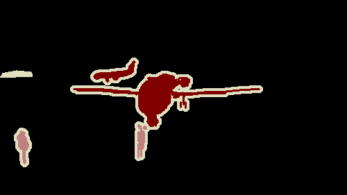
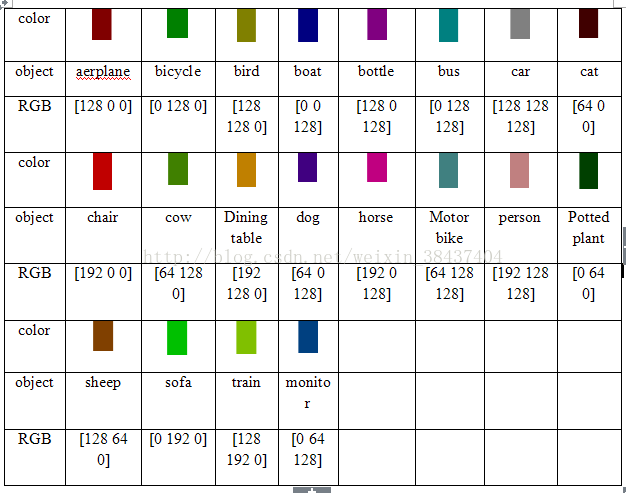
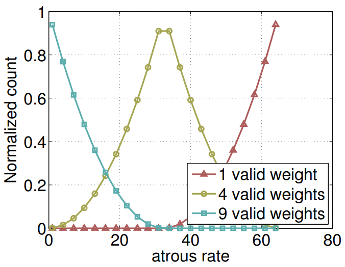
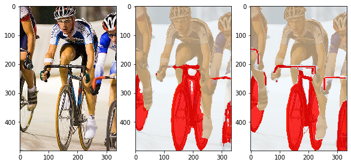

# Deeplabv3—语义分割

## 实验介绍

本实验主要介绍使用MindSpore深度学习框架在PASCAL VOC2012数据集上训练Deeplabv3网络模型。本实验使用了MindSpore开源仓库model_zoo中的[deeplabv3](https://gitee.com/mindspore/mindspore/tree/r1.0/model_zoo/official/cv/deeplabv3)模型案例。

图像的语义分割是计算机视觉中重要的基本问题之一，其目标是对图像的每个像素点进行分类，将图像分割为若干个视觉上有意义的或感兴趣的区域，以利于后续的图像分析和视觉理解。输入输出为大小相同的图片。

随着DCNN（深度卷积网络）的发展，图片中的特征更容易提取。Deeplab系列语义分割算法就是在DCNN算法的基础上发展而来。这里先描述一下语义分割DCNN网络是如
何设计，调整VGG16模型，转为一个可以有效提取特征的语义分割系统。具体来说，先将VGG16的FC层转为卷积层，模型变为全卷积的方式，在图像的原始分辨率上以非常
稀疏地方式计算（步幅32,步幅=输入尺寸/输出特征尺寸），为了以更密集（步幅8）的方式计算，我们在最后的两个最大池化层不进行下采样（same padding），而通
过2或4的采样率的空洞卷积对特征图做采样扩大感受野，缩小步幅。

此外分类器获取以对象中心的决策是需要空间变换的不变性，这天然的限制了DCNN的定位精度，DeepLabv采用完全连接的条件随机场(DenseCRF)提高模型捕获细节的能力(全局)。Deeplabv1采用了条件随机场（CRF）进行进一步精修，细化边缘分割效果。Deeplabv3使用aspp池化代替crf，简化了模型。

Deeplabv1使用带孔卷积(atrous convolution)（也叫膨胀卷积）, 能够明确地调整filters的感受野，并决定DNN计算得到特征的分辨率。使用crf捕捉全局特征，使边缘更锐利。Deeplabv2提出 Atrous Spatial Pyramid Pooling(ASPP)模块,挖掘不同尺度的卷积特征。Deeplabv3 编码了全局内容信息的图像层特征，提升分割效果。详细介绍参考论文：http://arxiv.org/abs/1706.05587 。

带孔卷积/膨胀卷积效果图：


[1] 图片来源 https://arxiv.org/pdf/1706.05587.pdf

Deeplabv3网络结构图：


[2] 图片来源 https://img.it610.com/image/info8/2caddeef33e4400791c34e4feed9d910.jpg

## 实验目的
* 了解如何使用MindSpore加载常用的PASCAL VOC2012数据集。
* 了解MindSpore的model_zoo模块，以及如何使用model_zoo中的模型。
* 了解Deeplabv3这类语义分割模型的基本结构和编程方法。

## 预备知识
* 熟练使用Python，了解Shell及Linux操作系统基本知识。
* 具备一定的深度学习理论知识，如Encoder、Decoder、损失函数、优化器，训练策略、Checkpoint等。
* 了解华为云的基本使用方法，包括[OBS（对象存储）](https://www. cloud.com/product/obs.html)、[ModelArts（AI开发平台）](https://www. cloud.com/product/modelarts.html)、[训练作业](https://support. cloud.com/engineers-modelarts/modelarts_23_0238.html)等功能。华为云官网：https://www. cloud.com。
* 了解并熟悉MindSpore AI计算框架，MindSpore官网：https://www.mindspore.cn/。

## 实验环境
* MindSpore 1.1.1（MindSpore版本会定期更新，本指导也会定期刷新，与版本配套）。
* 华为云ModelArts（控制台左上角选择“华北-北京四”）：ModelArts是华为云提供的面向开发者的一站式AI开发平台，集成了昇腾AI处理器资源池，用户可以在该平台下体验MindSpore。

## 实验准备

### 数据集准备

[Pascal VOC2012数据集](https://blog.csdn.net/haoji007/article/details/80361587)是针对视觉任务中监督学习的数据集，
它有二十个类别。主要有四个大类别，分别是人、常见动物、交通车辆、室内家具用品。这里使用VOC2012数据集中的分割数据进行fine-tune和测试。
可通过如下方式获取：

- 方式一，从官网下载数据集：VOC2012[官网地址](http://host.robots.ox.ac.uk/pascal/VOC/voc2012/index.html)，
[官方下载地址](http://host.robots.ox.ac.uk/pascal/VOC/voc2012/VOCtrainval_11-May-2012.tar)。

- 方式二，参考[lenet5（手写数字识别）](../lenet5)或[checkpoint（模型的保存和加载）](../checkpoint)实验，拷贝他人共享的OBS桶中的数据集。

```python
data_path = './VOC2012'
import moxing as mox
mox.file.copy_parallel(src_url="s3://share-course/dataset/voc2012_raw/", dst_url=data_path)
```

### 预训练模型准备

为了节省训练时间，本实验采用fine-tune的训练方式，我们提前准备好了预训练的[checkpoint文件](https://share-course.obs.cn-north-4.my cloud.com/checkpoint/deeplabv3/deeplab_v3_s8-300_11.ckpt)供下载使用，或使用如下方式直接拷贝到ModelArts执行容器中。

```python
ckpt_path = 'deeplab_s8.ckpt'
import moxing as mox
mox.file.copy_parallel(src_url="s3://share-course/checkpoint/deeplabv3/deeplab_v3_s8-300_11.ckpt", dst_url=ckpt_path)
```

该模型为VOCaug数据集训练得到。VOCaug数据集是VOC2012数据集和SBD数据集的集合。SBD数据属于VOC2012数据集，但是VOC2012数据集的训练或者验证图片的
标签图非常少。但是SBD给出的很多，所以可以综合这两个数据集得到更加多的带标签数据。

数据集名称|训练|测试
:--:|:--:|:--:
VOC2012数据集|1464|1449
SBD数据集|8498|2857
VOCaug数据集|8829|\

**解析：** VOCaug数据集8829样例个数已经去重。

本实验采用VOCaug数据集训练得到的DeeplabV3 Checkpoint，使用VOC2012训练数据集对模型进行微调训练，最后在VOC2012测试数据对模型进行测试。

### 脚本准备

从[课程gitee仓库](https://gitee.com/mindspore/course)上下载本实验相关脚本。

### 上传文件

点击新建的OBS桶名，再打开“对象”标签页，通过“上传对象”、“新建文件夹”等功能，将脚本和数据集上传到OBS桶中，组织为如下形式：

```
deeplabv3
├── code/
│   ├── src # 包括数据集处理、网络定义等
│   │   └── *.py
│   └── main.ipynb # 执行脚本，包括训练和推理过程
├── deeplab_s8.ckpt # 预训练模型文件
└── VOC2012/ # 数据集目录
```

## 实验步骤

### 代码梳理

代码文件说明：

- main.ipynb：代码入口文件；
- dataset.py：数据处理文件；
- loss.py：loss定义文件；
- deeplab_v3.py：Deeplabv3网络定义文件；
- learning_rates.py：学习率定义文件。

实验流程：

1. 修改main.ipynb训练参数并运行，运行训练cell得到模型文件。
2. 修改main.ipynb测试1（test 1 cell）参数并运行，运行测试1单元得到mean iou结果。
3. 修改main.ipynb测试2（test 2 cell）参数并运行，运行测试2单元得到可视化结果。

### 数据预处理（dataset.py）

数据处理流程如下所示：

1. 将语义标签（原始图片为三通道彩色）转换为灰度图（dataset.py中SegDataset.get_gray_dataset）
2. 将图片和标签灰度图转换为mindrecord格式数据集（dataset.py中SegDataset.get_mindrecord_dataset）
3. 读取mindrecord数据集并预处理。（dataset.py中SegDataset.get_dataset。其中preprocess_为数据预处理。）

具体过程如下所示，见（main.ipynb）

```python
# dataset
dataset = data_generator.SegDataset(image_mean=args.image_mean,
                                    image_std=args.image_std,
                                    data_file=args.data_file,
                                    batch_size=args.batch_size,
                                    crop_size=args.crop_size,
                                    max_scale=args.max_scale,
                                    min_scale=args.min_scale,
                                    ignore_label=args.ignore_label,
                                    num_classes=args.num_classes,
                                    num_readers=2,
                                    num_parallel_calls=4,
                                    shard_id=args.rank,
                                    shard_num=args.group_size)
dataset.get_gray_dataset()
dataset.get_mindrecord_dataset(is_training=True)
dataset = dataset.get_dataset(repeat=1)
```

#### VOC原始数据分析

VOC 数据集主要有 Object Classification（分类，20类） 、Object Detection（目标检测）、Object Segmentation（实例分割）、Human Layout（人体部位识别）、Action Classification（行为识别） 这几类子任务数据。总共分 4 个大类：vehicle、household、animal、person，总共 20 个小类（加背景 21 类）。类别如下所示。

- Person: person
- Animal: bird, cat, cow, dog, horse, sheep
- Vehicle: aeroplane, bicycle, boat, bus, car, motorbike, train
- Indoor: bottle, chair, dining table, potted plant, sofa, tv/monitor

VOC原始数据集包含以下目录结构：

```
VOC
├── Annotations   # 目标检测任务标签，xml 形式，文件名与图片名对应
├── ImageSets  # 存放不同任务训练和测试数据的编号，可根据编号在JPEGImages文件中找到参与训练和测试的数据图片。（有些任务编号直接带标签）
|   ├── Action        # 行为识别（包含数据编号和标签）,格式.txt 
|   ├── Layout        # 人体部位识别（包含数据编号和标签）,格式.txt
|   ├── Main          # 分类（包含数据编号和标签）,格式.txt
|   └──Segmentation   # 语义分割（包含数据编号，无对应标签，标签参考文件SegmentationClass）。
|       ├── trainval.txt
|       ├── val.txt
|       └── train.txt
├── JPEGImages            # 数据集所有原图（彩色三通道），格式.jpg
├── SegmentationClass     # 语义分割标签图（彩色三通道）,格式.png
└── SegmentationObject    # 实例分割标签图（彩色三通道）,格式.png
```

语义分割任务输入为图片（ImageSets/Segmentation文件中编号对应的在JPEGImages中的图片），输出为语义分割图（见SegmentationClass文件）。

ImageSets/Segmentation/train.txt文件如下所示，每一行对应一个编号（年_编号格式），这些编号在JPEGImages文件中可以找到，组成了训练集。测试集同理。

```
2007_000032
2007_000039
2007_000063
2007_000068
...
2011_003238
2011_003246
2011_003255
```

输入图片（JPEGImages中图片）如下所示：


语义分割标签图（SegmentationClass）中图片如下所示，（该分割图的原始图片为上图）



其中颜色对应标签如下所示：



[1]图片来源 https://blog.csdn.net/weixin_38437404/article/details/78788250?utm_source=blogxgwz7

#### 标签转化为灰度图

从上面的颜色标签对应图可以发现，虽然标签图是三通道的，但是颜色只有21种（加背景的黑色）。为了减少计算量，我们将彩色图转换为灰度图。转换代码见src/dataset.py中get_gray_dataset。如下所示：

```python
def get_gray_dataset(self):
    if os.path.exists(self.voc_anno_gray_dir):
        print('the gray file is already exists！')
        return
    os.makedirs(self.voc_anno_gray_dir)

    # convert voc color png to gray png
    print('converting voc color png to gray png ...')
    for ann in os.listdir(self.voc_anno_dir):
        ann_im = Image.open(os.path.join(self.voc_anno_dir, ann))
        ann_im = Image.fromarray(np.array(ann_im))
        ann_im.save(os.path.join(self.voc_anno_gray_dir, ann))
    print('converting done')
```

#### 将数据转换为mindrecord格式

本实验将图片和灰度分割图（标签）转换为mindrecord格式。见src/dataset.py中get_mindrecord_dataset函数。mindrecord字段包含：

- file_name ：图片名字，字段类型string；
- label ：语义分割灰度图，字段类型bytes；
- data：图片，字段类型bytes；

```python
def get_mindrecord_dataset(self, is_training,num_shards=1, shuffle=True):
        datas = []
        if is_training:
            data_lst = self.voc_train_lst
            self.mindrecord_save = os.path.join(self.mindrecord_save,'train')
        else:
            data_lst = self.voc_val_lst
            self.mindrecord_save = os.path.join(self.mindrecord_save,'eval')
        
        if os.path.exists(self.mindrecord_save):
            #shutil.rmtree(self.mindrecord_save)
            print('mindrecord file is already exists！')
            self.mindrecord_save = os.path.join(self.mindrecord_save,'VOC_mindrecord')
            return
        
        with open(data_lst) as f:
            lines = f.readlines()
        if shuffle:
            np.random.shuffle(lines)
            
        print('creating mindrecord dataset...')
        os.makedirs(self.mindrecord_save)
        self.mindrecord_save = os.path.join(self.mindrecord_save,'VOC_mindrecord')
        print('number of samples:', len(lines))
        seg_schema = {"file_name": {"type": "string"}, "label": {"type": "bytes"}, 
                      "data": {"type": "bytes"}}
        writer = FileWriter(file_name=self.mindrecord_save, shard_num=num_shards)
        writer.add_schema(seg_schema, "seg_schema")
        cnt = 0
        for l in lines:
            id_ = l.strip()
            img_path = os.path.join(self.voc_img_dir, id_ + '.jpg')
            label_path = os.path.join(self.voc_anno_gray_dir, id_ + '.png')
            
            sample_ = {"file_name": img_path.split('/')[-1]}
            with open(img_path, 'rb') as f:
                sample_['data'] = f.read()
            with open(label_path, 'rb') as f:
                sample_['label'] = f.read()
            datas.append(sample_)
            cnt += 1
            if cnt % 1000 == 0:
                writer.write_raw_data(datas)
                print('number of samples written:', cnt)
                datas = []

        if datas:
            writer.write_raw_data(datas)
        writer.commit()
        print('number of samples written:', cnt)
        print('Create Mindrecord Done')
```

#### 读取mindrecord数据集并预处理（仅训练）

训练时，读取前面构建好的mindrecord数据集，并进行归一化等预处理，参考见src/dataset.py中get_dataset函数preprocess_函数。具体预处理有以下几点：

1.  随机尺度缩放并归一化。
    -  sc为随机尺度，最小尺度为self.min_scale，默认为0.5。最大尺度为self.max_scale，默认为2.0。
    -  样本随机尺度缩放是图片增强常用方法之一。

```python
sc = np.random.uniform(self.min_scale, self.max_scale)
new_h, new_w = int(sc * image_out.shape[0]), int(sc * image_out.shape[1])
image_out = cv2.resize(image_out, (new_w, new_h), interpolation=cv2.INTER_CUBIC)
label_out = cv2.resize(label_out, (new_w, new_h), interpolation=cv2.INTER_NEAREST)

image_out = (image_out - self.image_mean) / self.image_std      # 归一化
```

2. 裁剪填充，代码如下所示。
   - self.crop_size设定为513，代表默认训练/测试图片大小为 $ 513 * 513 $ 。
   - self.ignore_label为255，代表标签图（语义分割灰度图）使用黑色填充边框/空白。
   - 图片使用白色填充边框/空白。
   - 经过裁剪填充以后的图片尺寸变大，最小尺寸为 $ 513 * 513 $ 。
   - 经过裁剪以后的图片和标签图保留了图片原有的信息。

```python
h_, w_ = max(new_h, self.crop_size), max(new_w, self.crop_size)
pad_h, pad_w = h_ - new_h, w_ - new_w
if pad_h > 0 or pad_w > 0:
    image_out = cv2.copyMakeBorder(image_out, 0, pad_h, 0, pad_w,      
                                   cv2.BORDER_CONSTANT, value=0)
    label_out = cv2.copyMakeBorder(label_out, 0, pad_h, 0, pad_w, 
                  cv2.BORDER_CONSTANT, value=self.ignore_label)
```

3.  图片resize，统一图片尺寸，切割图片尺寸为 [513,513] （self.crop_size），其中offset_h和offset_w为随机切割起点（图片增强方式）。

```python
offset_h = np.random.randint(0, h_ - self.crop_size + 1)
offset_w = np.random.randint(0, w_ - self.crop_size + 1)
image_out = image_out[offset_h: offset_h + self.crop_size, offset_w: offset_w + self.crop_size, :]
label_out = label_out[offset_h: offset_h + self.crop_size, offset_w: offset_w+self.crop_size]
```

4. 随机左右翻转，图片随机翻转是数据增强的常用方法之一。

```python
if np.random.uniform(0.0, 1.0) > 0.5:
    image_out = image_out[:, ::-1, :]
    label_out = label_out[:, ::-1]
```

**注意：** 测试时，数据输入格式为tensor，数据预处理方式与训练相似（没有经过数据增强）。

### Deeplabv3网络结构（deeplab_v3.py）

本实验的Deeplabv3网络主要由ResNet特征提取模块、ASPP模块组成。

```
- class DeepLabV3
    - class Resnet
        - 略（参考实验resnet50）
    - class ASPP
        - class ASPPConv -> x1
            - nn.Conv2d（dilation=atrous_rate）   # 膨胀卷积
            - nn.BatchNorm2d
            - nn.ReLU
        - class ASPPConv(共四个) -> x2, x3, x4
        - class ASPPPooling -> x5
            - nn.AvgPool2d
            - nn.Conv2d             # 普通卷积，非膨胀
            - nn.BatchNorm2d
            - nn.ReLU
            - P.ResizeNearestNeighbor
        - P.Concat(x1,x2,x3,x4,x5)  
        - nn.Conv2d             # 普通卷积，非膨胀
        - nn.BatchNorm2d
        - nn.ReLU
        - nn.Conv2d             # 普通卷积，非膨胀,out_class为num_class(21)
    - P.ResizeBilinear
```

#### ASPP模块

Deeplabv2中的ASPP在特征顶部映射图使用了四种不同采样率的空洞卷积。这表明以不同尺度采样是有效的，在Deeplabv3中向ASPP中添加了BN层（参考class ASPPConv）。
不同采样率的空洞卷积可以有效捕获多尺度信息，但会发现随着采样率的增加，滤波器有效权重（权重有效的应用在特征区域，而不是填充0的边缘区域）逐渐变小。如下图所示：



[4] 图片来源 https://arxiv.org/pdf/1706.05587.pdf

针对上面的问题，并将全局内容信息整合进模型中，则采用图像级特征。采用全局平均池化(global average pooling)对模型的feature map进行处理，将得到的
图像级特征输入到一个1×1 convolution with 256 filters(加batch normalization)中，然后将特征进行双线性上采样(bilinearly upsample)到特
定的空间维度。（参考class ASPPPooling）

Deeplabv3网络变量分析：

名称|维度|描述
:--:|:--:|:--:
images_x|(16, 3, 513, 513)|输入图片维度 [batch_size, channel,h,w]
lables|(16, 513, 513)|输入图片的标签  [batch_size, h,w] （见loss.py中labels）
resnet_out|(16, 2048, 65, 65)|resnet输出(特征提取)
aspp_x1|(16,256, 65, 65) | 第一个aspp输出（见代码aspp1输出）, rate = 1 
aspp_x2|(16,256, 65, 65) | 第二个aspp输出（见代码aspp2输出）,  rate =6 
aspp_x3|(16,256, 65, 65) | 第三个aspp输出（见代码aspp3输出）,  rate =12 
aspp_x4|(16,256, 65, 65) | 第四个aspp输出（见代码aspp4输出）,  rate =18 
aspp_pooling_x5|(16,256, 65, 65) | aspp_pooling输出（见代码aspp_pooling输出） 
concat_x|(16, 1280, 65, 65)| 前面五个x  concat
ASPP_out|(16, 21, 65, 65)| ASPP模块输出（concat以后经过了两个卷积）
net_out|(16, 21, 513, 513)|ASPP模块输出经过P.ResizeBilinear操作，是整个网络输出。

**解析：** 

1. 表中的名称与代码有些出入，请根据表中英文名确定变量与代码对应关系。
2. Deeplabv3网络输出net_out维度为(16,21,513,513)。训练计算loss时（参考loss.py），使用该结果和lables比较，进行梯度更新。

### 测试流程（数据流）

本实验由两种测试方式，计算平均iou值和结果可视化。这两种方式的数据预处理和模型部分是一致的，只在结果的展示部分有区别。

#### 构建测试网络

构建测试网络的代码如下所示，在DeepLabV3网络（参考前面Deeplabv3网络结构）的最后加了softmax层，保证输出概率为0-1的范围内。
```python
class BuildEvalNetwork(nn.Cell):
    def __init__(self, network):
        super(BuildEvalNetwork, self).__init__()
        self.network = network
        self.softmax = nn.Softmax(axis=1)

    def construct(self, input_data):
        output = self.network(input_data)
        output = self.softmax(output)
        return output

# network
if args.model == 'deeplab_v3_s16':
    network = deeplab_v3.DeepLabV3('eval', args.num_classes, 16, args.freeze_bn)
elif args.model == 'deeplab_v3_s8':
    network = deeplab_v3.DeepLabV3('eval', args.num_classes, 8, args.freeze_bn)
else:
    raise NotImplementedError('model [{:s}] not recognized'.format(args.model))

eval_net = BuildEvalNetwork(network)
```

#### 测试数据处理

测试数据预处理部分与训练相似，但是没有做数据增强，只保留图片本身信息。测试数据后处理主要是将结果图片resize为原始大小，并利用argmax函数得到最后结果。测试数据处理过程如下所示，参考main.py测试部分。

1. 读取图片和标签图，并分为batch。batch_img_lst变量中存放原始图片，列表长度为batch_size。batch_msk_lst变量中存放原始标签，列表长度为batch_size。

```python
batch_img_lst = []
batch_msk_lst = []
image_num = 0
for i, line in enumerate(img_lst):
    id_ = line.strip()
    img_path = os.path.join(cfg.voc_img_dir, id_ + '.jpg')
    msk_path = os.path.join(cfg.voc_anno_gray_dir, id_ + '.png')
            
    img_ = cv2.imread(img_path)
    msk_ = cv2.imread(msk_path, cv2.IMREAD_GRAYSCALE)
    batch_img_lst.append(img_)
    batch_msk_lst.append(msk_)
```

2. 图像预处理，见pre_process函数。
    - 对原始图片resize并pad得到(513,513)图片 ，作为网络的输入。返回值为：
        * resize为（513，513）大小的图片（img_）
        * 长宽等比例缩放以后的尺寸（resize_h, resize_w）（见resize_long函数）。
    - 归一化，归一化的方差和均值与训练一致。

**提示：裁剪结果resize_h, resize_w中有一条边（原始长边）变为513，另一条同比例改变，变为小于513。**

```python
def resize_long(img, long_size=513):
    h, w, _ = img.shape
    if h > w:
        new_h = long_size
        new_w = int(1.0 * long_size * w / h)
    else:
        new_w = long_size
        new_h = int(1.0 * long_size * h / w)
    imo = cv2.resize(img, (new_w, new_h))
    return imo

def pre_process(args, img_, crop_size=513):
    # resize
    img_ = resize_long(img_, crop_size)
    resize_h, resize_w, _ = img_.shape

    # mean, std
    image_mean = np.array(args.image_mean)
    image_std = np.array(args.image_std)
    img_ = (img_ - image_mean) / image_std

    # pad to crop_size
    pad_h = crop_size - img_.shape[0]
    pad_w = crop_size - img_.shape[1]
    if pad_h > 0 or pad_w > 0:
        img_ = cv2.copyMakeBorder(img_, 0, pad_h, 0, pad_w, cv2.BORDER_CONSTANT, value=0)

    # hwc to chw
    img_ = img_.transpose((2, 0, 1))
    return img_, resize_h, resize_w
```

3.  利用Deeplabv3网络进行预测，再行后处理。后处理见post_process，支持反向预测来增加结果准备度。后处理将结果（16，21，513，513）resize为原始尺寸大小。

```python
def eval_batch(args, eval_net, img_lst, crop_size=513, flip=True):
    ...
    if flip:
        batch_img = batch_img[:, :, :, ::-1]
        net_out_flip = eval_net(Tensor(batch_img, mstype.float32))
        net_out += net_out_flip.asnumpy()[:, :, :, ::-1]

    for bs in range(batch_size):
        probs_ = net_out[bs][:, :resize_hw[bs][0], :resize_hw[bs][1]].transpose((1, 2, 0))        
        ori_h, ori_w = img_lst[bs].shape[0], img_lst[bs].shape[1]
        probs_ = cv2.resize(probs_, (ori_w, ori_h))
        result_lst.append(probs_)
    return result_lst
```

4. 测试支持多尺度预测，即考虑多种尺度输入图片并将结果相加以提高预测精度。参数scales，默认为[1.0]，列表（list）类型。可以多添加几种尺度，列表长度
代表每个样例测试次数，会影响测试速度。参考eval_batch_scales函数。

```python

def eval_batch_scales(args, eval_net, img_lst, scales,
                      base_crop_size=513, flip=True):
    sizes_ = [int((base_crop_size - 1) * sc) + 1 for sc in scales]
    probs_lst = eval_batch(args, eval_net, img_lst, crop_size=sizes_[0], flip=flip)

    for crop_size_ in sizes_[1:]:
        probs_lst_tmp = eval_batch(args, eval_net, img_lst, crop_size=crop_size_, flip=flip)
        for pl, _ in enumerate(probs_lst):
            probs_lst[pl] += probs_lst_tmp[pl]

    result_msk = []
    for i in probs_lst:
        result_msk.append(i.argmax(axis=2))
    return result_msk
```

### 训练输入文件导入

```python
import moxing as mox
data_path = './VOC2012'
if not os.path.exists(data_path):
    mox.file.copy_parallel(src_url="s3://share-course/dataset/voc2012/", dst_url=data_path)
cfg.data_file = data_path

ckpt_path = 'deeplab_s8.ckpt'
if not os.path.exists(ckpt_path):
    mox.file.copy_parallel(src_url="s3://share-course/checkpoint/deeplabv3/deeplab_v3_s8-800_82.ckpt", dst_url=ckpt_path)
cfg.ckpt_file = ckpt_path
```

### 评价指标和可视化

前面已经提到测试有两种方式，方式一为平均iou，方式二为结果可视化。由测试cfg中`if_png`参数控制。当`if_png`为`True`则采用可视化方式，当`if_png`
为`False`则计算推理结果和真实标签的平均iou（计算方式如下所示）。

```python
def cal_hist(a, b, n):
    k = (a >= 0) & (a < n)
    return np.bincount(n * a[k].astype(np.int32) + b[k], minlength=n ** 2).reshape(n, n)
```

### 训练输入文件导入

```python
import moxing as mox
data_path = './VOC2012'
if not os.path.exists(data_path):
    mox.file.copy_parallel(src_url="s3://share-course/dataset/voc2012/", dst_url=data_path)
cfg.data_file = data_path
from src.data import dataset as data_generator
# dataset
dataset = data_generator.SegDataset(image_mean=cfg.image_mean,
                                    image_std=cfg.image_std,
                                    data_file=cfg.data_file)
dataset.get_gray_dataset()
cfg.data_lst = os.path.join(cfg.data_file,'ImageSets/Segmentation/val.txt')
cfg.voc_img_dir = os.path.join(cfg.data_file,'JPEGImages')
cfg.voc_anno_gray_dir = os.path.join(cfg.data_file,'SegmentationClassGray')

ckpt_path = './model'
if not os.path.exists(ckpt_path):
    mox.file.copy_parallel(src_url="s3://{user_obs}/model", dst_url=ckpt_path)   # if model had saved.
cfg.ckpt_file = os.path.join(ckpt_path,'deeplab_v3_s8-3_91.ckpt')  
print('loading checkpoing:',cfg.ckpt_file)
```

### 训练参数设定：

```python
cfg = edict({
    "batch_size": 16,
    "crop_size": 513,
    "image_mean": [103.53, 116.28, 123.675],
    "image_std": [57.375, 57.120, 58.395],
    "min_scale": 0.5,
    "max_scale": 2.0,
    "ignore_label": 255,
    "num_classes": 21,
    "train_epochs" : 3,

    "lr_type": 'cos',
    "base_lr": 0.0,

    "lr_decay_step": 3*91,
    "lr_decay_rate" :0.1,

    "loss_scale": 2048,      

    "model": 'deeplab_v3_s8',
    'rank': 0,
    'group_size':1,
    'keep_checkpoint_max':1,
    'train_dir': 'model',

    'is_distributed':False,
    'freeze_bn':True
})
```

### 测试参数设定：

```python
cfg = edict({
    "batch_size": 1,
    "crop_size": 513,
    "image_mean": [103.53, 116.28, 123.675],
    "image_std": [57.375, 57.120, 58.395],
    "scales": [1.0],           # [0.5,0.75,1.0,1.25,1.75]
    'flip': True,

    'ignore_label': 255,
    'num_classes':21,

    'model': 'deeplab_v3_s8',
    'freeze_bn': True,
    
    'if_png':False,
    'num_png':5
})
```

## 实验结果

### 训练日志结果

```
converting voc color png to gray png ...
converting done
creating mindrecord dataset...
number of samples: 1464
number of samples written: 1000
number of samples written: 1464
Create Mindrecord Done
epoch: 1 step: 91, loss is 0.004917805
Epoch time: 183256.301, per step time: 2013.806
epoch: 2 step: 91, loss is 0.00791893
Epoch time: 47812.316, per step time: 525.410
epoch: 3 step: 91, loss is 0.0061199386
Epoch time: 47803.087, per step time: 525.309
```
### 测试iou结果

```
the gray file is already exists！
loading checkpoing: ./model/deeplab_v3_s8-3_91.ckpt
processed 100 images
processed 200 images
processed 300 images
processed 400 images
processed 500 images
processed 600 images
processed 700 images
processed 800 images
processed 900 images
processed 1000 images
processed 1100 images
processed 1200 images
processed 1300 images
processed 1400 images
mean IoU 0.7709573541968988
```

### 测试图片输出结果

取其中一张图片结果如下所示：



```
prediction num: [ 0  2 15]
prediction color: ['background', 'bicycle', 'person']
prediction class: ['aliceblue', 'red', 'tan']
groundtruth num: [ 0  2 15]
groundtruth color: ['background', 'bicycle', 'person']
groundtruth class: ['aliceblue', 'red', 'tan']
```

**注解：** 以上三张图片，第左边为原始图片，中间为预测语义分割图，最右边为真实语义分割标签图。

## 结论

本实验主要介绍使用MindSpore实现Deeplabv3网络，实现语义分割。分析原理和结果可得：

- Deeplabv3网络对语义分割任务有效。
- Deeplabv3网络对语义分割中细节效果较差。但是大概轮廓较好。
